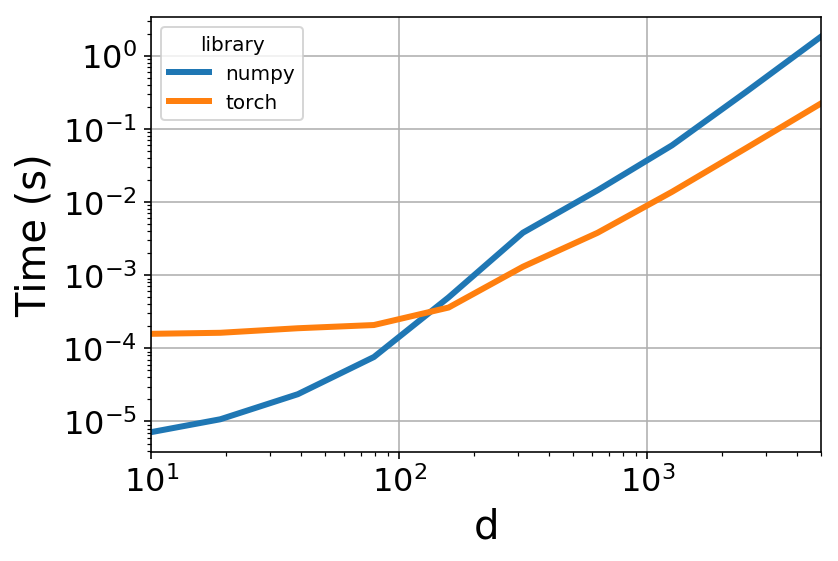
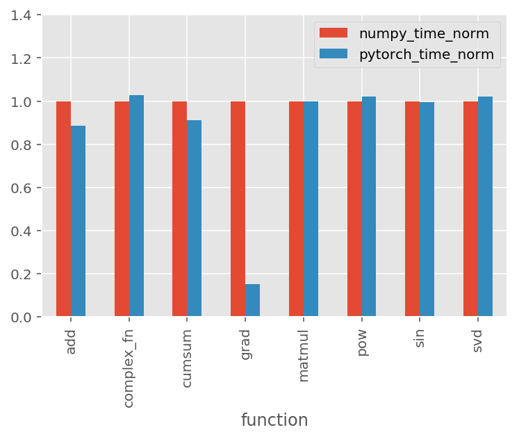
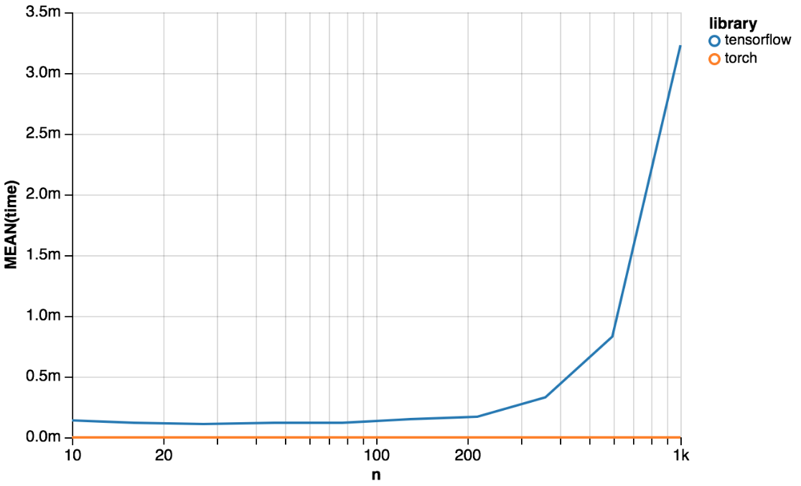
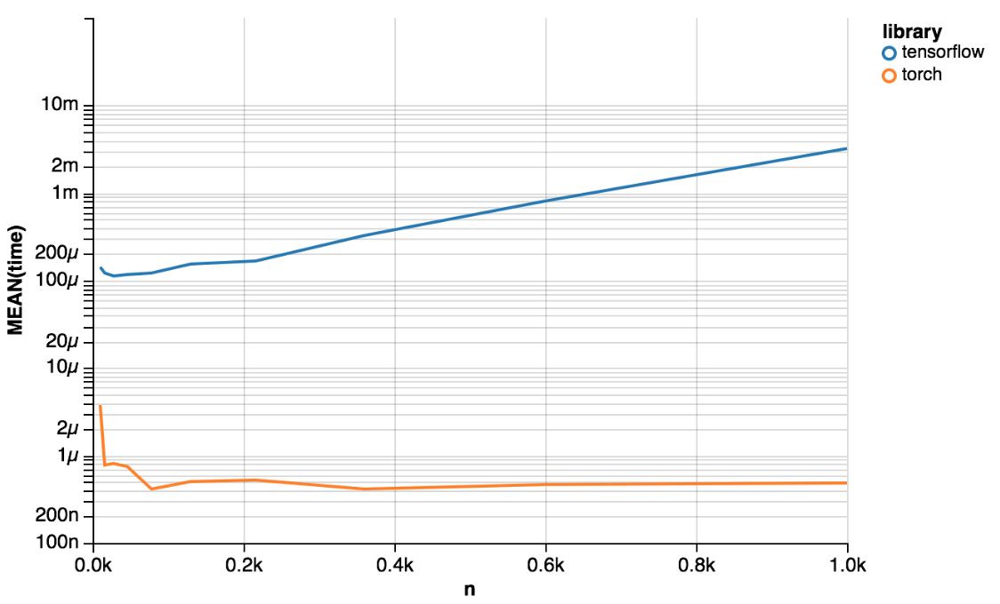

Comparing with NumPy gradient calculation:

Comparing with many different NumPy functions:

Comaring `torch.numpy()` with `tf.session.eval`:

...but that's not a super useful visualization. Let's use a log y-axis instead:

