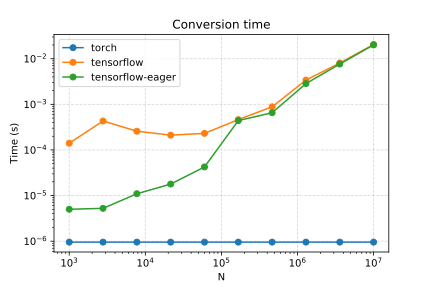

This measures conversion from NumPy array to one of

* `torch.Tensor`
* `tf.constant`
* `tf.constant` with Tensorflow's eager execution

This is a result of PyTorch's dynamic graph and the memory structure of `torch.Tensor`.

Comparing with NumPy gradient calculation:

